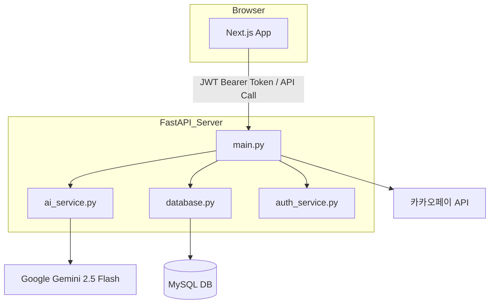
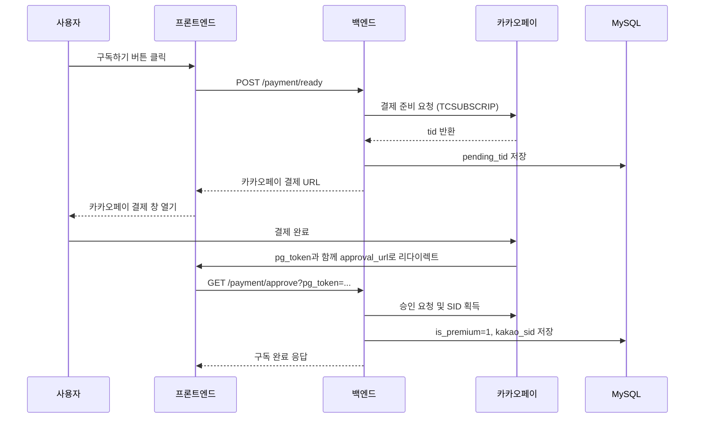

# **📚 두루 (Duru) 국어 AI 프로젝트 보고서**

> **작성일 :** 2026년 3월 14일
> 
> 
> **상태 :** 개발 완료
>

---

## **0. 시연 영상**
https://www.youtube.com/playlist?list=PLFvX6ZDAWK0UO3BIB7KKQQYiMDjQ4RjwY

---

## **1. 프로젝트 개요**

두루(Duru)는 초·중·고등학생을 대상으로 한 AI 기반 국어 학습 보조 서비스입니다.
Google Gemini AI 모델을 활용해 국어 지문을 자동 분석하고, 
학년 수준에 맞는 해설 · 요약 · 연습 문제 · 글쓰기 첨삭 기능을 제공합니다. 

### **핵심 기능**

| **기능** | **설명** |
| --- | --- |
| 📝 텍스트 분석 | 입력 지문을 Gemini AI가 학년 맞춤 해설 |
| 📷 이미지 분석 | 교재 사진 업로드 → OCR + AI 분석 (멀티모달) |
| 📖 객관식 문제 | 지문 기반 내신형/수능형 문제 자동 생성 |
| ✍️ 서술형 문제 | 서술형 문제 생성 + 루브릭 기반 자동 채점 |
| 🔤 글쓰기 첨삭 | 학생 글 교정 및 학년별 피드백 |
| 📊 학습 기록 | 분석·연습 히스토리 통합 조회·삭제 |
| 💳 카카오페이 | 프리미엄 멤버십 정기결제 및 해지 |

---

## **2. 기술 스택**

### **백엔드 (Backend)**

| **항목** | **기술** | **비고** |
| --- | --- | --- |
| 언어 | Python 3.12 | .venv 가상환경 |
| 웹 프레임워크 | FastAPI | Uvicorn으로 실행 |
| AI 모델 | Google Gemini 2.5 Flash | `google-generativeai` 라이브러리 |
| 인증 | JWT (python-jose) | HS256 알고리즘, 24시간 유효 |
| 비밀번호 암호화 | passlib (pbkdf2_sha256) |  |
| 데이터베이스 | MySQL | `mysql-connector-python` |
| 결제 | 카카오페이 API | 정기결제(SID) 방식 |

### **프론트엔드 (Frontend)**

| **항목** | **기술** | **비고** |
| --- | --- | --- |
| 언어 | JavaScript (ES6+) |  |
| 프레임워크 | Next.js 14 | App Router 방식 |
| 상태 관리 | React Context API | **TrackContext.js** |
| HTTP 클라이언트 | Axios | 인터셉터 기반 자동 토큰 처리 |
| 스타일링 | CSS + Inline 클래스 | 다크모드 지원 (Pro 트랙) |

---

## **3. 시스템 아키텍처**



---

## **4. 프로젝트 구조**

```
duru_korean/
├── backend/
│   ├── main.py                  ← FastAPI 진입점 (1,533줄), 모든 API 엔드포인트
│   ├── models.py                ← Pydantic 모델 (요청/응답 스키마)
│   └── services/
│       ├── ai_service.py        ← Gemini AI 연동, 학년별 프롬프트 엔진 (핵심)
│       ├── database.py          ← MySQL CRUD 함수 전체
│       └── auth_service.py      ← 회원가입/로그인/JWT 발급·검증
└── frontend/
    └── src/
        ├── app/
        │   ├── page.js          ← 로그인 페이지
        │   ├── signup/          ← 회원가입
        │   ├── analyze/         ← 지문 분석 (텍스트 + 이미지)
        │   ├── practice/
        │   │   ├── multiple-choice/  ← 객관식 연습
        │   │   ├── essay/            ← 서술형 연습
        │   │   └── writing/          ← 글쓰기 첨삭
        │   ├── history/         ← 학습 기록 목록 + 상세
        │   ├── mypage/          ← 마이페이지 (트랙/학년/구독 관리)
        │   ├── select-track/    ← 트랙 선택 온보딩
        │   └── payment/         ← 카카오페이 결제 결과 처리
        ├── contexts/
        │   └── TrackContext.js  ← 전역 상태: 트랙·학년·다크모드
        ├── utils/
        │   └── api.js           ← Axios 인스턴스 + 모든 API 호출 함수
        └── components/
            ├── Navbar.js        ← 공통 하단 네비게이션 바
            └── TrackWrapper.js  ← TrackProvider 래퍼 컴포넌트
```

---

## **5. 전체 API 엔드포인트 목록**

### **인증 (Auth)**

| **메서드** | **경로** | **설명** |
| --- | --- | --- |
| `POST` | `/auth/signup` | 회원가입 (비밀번호 bcrypt 해싱) |
| `POST` | `/auth/login` | 로그인 → JWT 토큰 발급 |
| `GET` | `/auth/me` | 내 정보·잔여 사용량 조회 |
| `PUT` | `/auth/update` | 비밀번호 변경 |

### **분석 (Analysis)**

| **메서드** | **경로** | **설명** |
| --- | --- | --- |
| `POST` | `/analyze` | 텍스트 분석 + DB 저장 |
| `POST` | `/analyze/image` | 이미지(OCR) 분석 + DB 저장 |
| `GET` | `/contents/list` | 분석 목록 조회 (검색 지원) |
| `GET` | `/contents/detail/{id}` | 분석 상세 조회 |
| `DELETE` | `/contents/{id}` | 분석 기록 삭제 |

### **연습 (Practice)**

| **메서드** | **경로** | **설명** |
| --- | --- | --- |
| `POST` | `/practice/generate-questions` | 객관식 문제 생성 (분석된 지문 기반) |
| `POST` | `/practice/generate-questions/image` | 이미지 기반 객관식 문제 생성 |
| `POST` | `/practice/generate-essay` | 서술형 문제 생성 |
| `POST` | `/practice/generate-essay/image` | 이미지 기반 서술형 문제 생성 |
| `POST` | `/practice/grade-essay` | 서술형 답안 자동 채점 |
| `POST` | `/practice/proofread` | 글쓰기 첨삭 |
| `POST` | `/practice/submit-answer` | 객관식 개별 답안 제출 |
| `POST` | `/practice/submit` | 전 문항 일괄 채점 결과 저장 |
| `GET` | `/practice/history` | 연습 기록 목록 조회 |
| `GET` | `/practice/history/{id}` | 연습 기록 상세 조회 |
| `DELETE` | `/practice/history/{id}` | 연습 기록 삭제 |

### **통합 기록 & 결제**

| **메서드** | **경로** | **설명** |
| --- | --- | --- |
| `GET` | `/records/all` | 분석+연습 통합 기록 조회 |
| `POST` | `/payment/ready` | 카카오페이 결제 준비 |
| `GET` | `/payment/approve` | 카카오페이 결제 승인 → SID 발급 |
| `POST` | `/payment/unsubscribe` | 정기구독 해지 |
| `GET` | `/admin/stats` | 관리자 통계 조회 |

---

## **6. 핵심 코드 상세 설명**

### **6-1. AI 프롬프트 엔진 (backend/services/ai_service.py)**

프로젝트의 가장 핵심 파일로, 학년(Mode)에 따라 다른 프롬프트를 선택하고 Google Gemini API를 호출합니다.

```python
class Mode(str, Enum):
    ELEMENTARY  = "ELEMENTARY"   # 초등 (Play 트랙)
    MIDDLE      = "MIDDLE"       # 중학
    HIGH        = "HIGH"         # 고등
    MIDDLE_HIGH = "MIDDLE_HIGH"  # 레거시 호환용 → 내부에서 MIDDLE로 처리
```

**프롬프트 구성:**

| **변수** | **학년** | **유형** | **특징** |
| --- | --- | --- | --- |
| `ELEMENTARY_FREE` | 초등 | 무료 | 3~4문장, 쉬운 말투, 한자어 금지 |
| `ELEMENTARY_PRO` | 초등 | 유료 | 5~6문장, 다양한 예시, 핵심 요약 |
| `MIDDLE_FREE` | 중등 | 무료 | 내신 핵심 개념, 시험 키워드 중심 |
| `MIDDLE_PRO` | 중등 | 유료 | 표현 기법 심층 분석, 핵심 요약 |
| `HIGH_FREE` | 고등 | 무료 | 수능형 분석, 논리 구조 파악 |
| `HIGH_PRO` | 고등 | 유료 | 수능·논술 심화 분석, 핵심 요약 |

모든 프롬프트에 공통 적용되는 `COMMON_RULE`에는:

- JSON 출력 형식 강제 (`detected_title`, `detected_author`, `explanation`, `mbti`, `chat_version`, `summary`)
- 작가 생애 언급 금지, MBTI는 '화자' 기준으로 분석
- JSON 내 큰따옴표 사용 금지 (파싱 오류 방지)

**주요 AI 함수 목록:**

| **함수명** | **용도** |
| --- | --- |
| **analyze_content_with_ai()** | 지문 해설 (텍스트·이미지 공용) |
| **generate_multiple_choice()** | 객관식 문제 생성 |
| **generate_essay_question()** | 서술형 문제 생성 |
| **grade_essay()** | 서술형 답안 채점 |
| **proofread_text()** | 글쓰기 첨삭 |

---

### **6-2. API 서버 (backend/main.py)**

1,533줄 규모의 FastAPI 앱으로, 인증·분석·연습·결제 등 모든 비즈니스 로직을 담당합니다.

**CORS 설정:**

```python
app.add_middleware(
    CORSMiddleware,
    allow_origins=["*"],      # 개발 환경: 전체 허용
    allow_credentials=True,
    allow_methods=["*"],
    allow_headers=["*"],
)
```

**무료/유료 사용자 제한 로직:**

```python
# 1. JWT 토큰이 아닌 DB를 직접 조회하여 최신 프리미엄 상태 확인
cursor.execute("SELECT is_premium FROM users WHERE id = %s", (user_id,))
is_premium = db_user['is_premium']

# 2. 무료 사용자: 하루 3회 제한
if not check_daily_limit(user_id, is_premium):
    raise HTTPException(status_code=429, detail="...")

# 3. 분석 성공 후 사용량 증가
if not is_premium:
    increment_daily_count(user_id)

# 4. 잔여 횟수 반환
remaining = 999 if is_premium else max(0, 3 - current_usage)
```

**모드 정규화 로직 (모든 엔드포인트 공통 적용):**

```python
request_mode = request.mode.upper()
if request_mode == "MIDDLE_HIGH":
    request_mode = "MIDDLE"  # 레거시 DB 데이터 호환
try:
    selected_mode = Mode[request_mode]
except KeyError:
    selected_mode = Mode.MIDDLE
```

**분석 후 AI 인식 메타데이터 자동 적용:**

```python
detected_title = ai_result.get("detected_title", "제목 미상")
detected_author = ai_result.get("detected_author", "작가 미상")

# 사용자가 기본값을 제출한 경우만 AI 인식 결과로 대체
default_titles = ["제목 없음", "텍스트 분석", "이미지 분석", "", None]
if request.title in default_titles and detected_title != "제목 미상":
    final_title = detected_title
```

---

### **6-3. 데이터베이스 계층 (backend/services/database.py)**

MySQL과의 모든 CRUD를 담당합니다.

**분석 결과 저장 시 JSON 직렬화:**

```python
interpretation_data = {
    "mbti": result_dict.get("mbti", ""),
    "chat_version": result_dict.get("chat_version", ""),
    "summary": result_dict.get("summary", "")
}
# modern_interpretation 컬럼에 JSON 문자열로 저장
"interpretation": json.dumps(interpretation_data, ensure_ascii=False)
```

**통합 기록 조회 (`/records/all`):**

`contents` 테이블(분석 기록)과 `practice_sessions` 테이블(연습 기록)을 각각 쿼리 후 Python에서 날짜 기준으로 병합·정렬하여 반환합니다.

---

### **6-4. 인증 서비스 (backend/services/auth_service.py)**

```python
# pbkdf2_sha256 방식으로 비밀번호 해싱
pwd_context = CryptContext(schemes=["pbkdf2_sha256"], deprecated="auto")

def create_access_token(data: dict):
    expire = datetime.utcnow() + timedelta(minutes=1440)  # 24시간
    return jwt.encode({...expire}, SECRET_KEY, algorithm="HS256")

def get_current_user(token: str):
    payload = jwt.decode(token, SECRET_KEY, algorithms=["HS256"])
    return {"username": payload["sub"], "id": payload["user_id"]}
```

JWT 페이로드에 `user_id`, `username`, `is_premium`을 포함해 매 요청마다 DB 조회 없이 기본 식별 가능합니다. (단, 프리미엄 여부는 실시간성을 위해 DB에서 재조회)

---

### **6-5. 전역 상태 관리 (frontend/src/contexts/TrackContext.js)**

React Context로 앱 전체에서 학습 모드를 공유합니다.

```jsx
// 트랙: "play" (초등) / "pro" (중·고등)
const [track, setTrackState] = useState("pro");
const [grade, setGradeState] = useState("MIDDLE");  // ELEMENTARY / MIDDLE / HIGH
const [isDarkMode, setIsDarkMode] = useState(false); // Pro 트랙 전용

// 트랙 변경 시 기본 학년 자동 설정
const setTrack = (newTrack) => {
  const newGrade = newTrack === "play" ? "ELEMENTARY" : "MIDDLE";
  setGradeState(newGrade);
  localStorage.setItem("duru_grade", newGrade);
};

// API 호출 시 사용할 최종 모드 반환
const getDefaultGrade = () =>
  track === "play" ? "ELEMENTARY" : grade;
```

`localStorage`에 `duru_track`, `duru_grade`, `duru_dark_mode`를 저장해 새로고침 후에도 설정이 유지됩니다.

---

### **6-6. API 클라이언트 (frontend/src/utils/api.js)**

Axios 인터셉터를 사용해 **모든 HTTP 요청에 JWT 자동 삽입, 401 시 자동 로그아웃**을 처리합니다.

```jsx
// 요청 인터셉터: 토큰 자동 삽입
api.interceptors.request.use((config) => {
  const token = localStorage.getItem("token");
  if (token) config.headers.Authorization = `Bearer ${token}`;
  return config;
});

// 응답 인터셉터: 인증 만료 시 로그아웃
api.interceptors.response.use(
  (response) => response,
  (error) => {
    if (error.response?.status === 401) {
      localStorage.removeItem("token");
      window.location.href = "/";
    }
    return Promise.reject(error);
  }
);
```

총 **18개의 API 호출 함수**가 정의되어 있으며, 함수명이 명확해 각 페이지 컴포넌트에서 바로 임포트해서 사용 가능합니다.

---

## **7. 데이터베이스 스키마 상세**

### **`users` 테이블**

| **컬럼** | **타입** | **설명** |
| --- | --- | --- |
| **id** | INT PK | 사용자 고유 ID |
| `username` | VARCHAR | 로그인 아이디 |
| **password** | VARCHAR | pbkdf2_sha256 해시 |
| `nickname` | VARCHAR | 표시 이름 |
| `is_premium` | TINYINT | 0: 무료, 1: 유료 |
| `user_mode` | VARCHAR | PRO / PLAY |
| `kakao_sid` | VARCHAR | 카카오페이 정기결제 SID |
| `pending_tid` | VARCHAR | 결제 승인 대기 TID |
| `last_order_id` | VARCHAR | 마지막 주문 ID |
| `created_at` | DATETIME | 가입일 |

### **`contents` 테이블 (분석 결과)**

| **컬럼** | **타입** | **설명** |
| --- | --- | --- |
| **id** | INT PK | 분석 기록 ID |
| `user_id` | INT FK | 소유 사용자 |
| `title` | VARCHAR | 작품 제목 |
| `author` | VARCHAR | 작가 |
| `grade_level` | VARCHAR | ELEMENTARY / MIDDLE / HIGH |
| `body_text` | TEXT | 원문 (이미지 분석 시 플레이스홀더) |
| `ai_explanation` | TEXT | AI 해설 |
| `modern_interpretation` | JSON | `{mbti, chat_version, summary}` |
| `created_at` | DATETIME | 분석 일시 |

### **`practice_sessions` 테이블**

| **컬럼** | **타입** | **설명** |
| --- | --- | --- |
| **id** | INT PK | 세션 ID |
| `user_id` | INT FK | 사용자 |
| `content_id` | INT FK | 연관 분석 ID (선택) |
| `practice_type` | VARCHAR | multiple_choice / essay / writing |
| `work_title` | VARCHAR | 작품명 |
| `work_author` | VARCHAR | 작가명 |
| **grade** | VARCHAR | 학년 |
| `question_data` | JSON | 생성된 문제 전체 |
| `question_count` | INT | 총 문제 수 |
| `final_score` | INT | 최종 점수 |
| `is_completed` | TINYINT | 완료 여부 |
| `created_at` | DATETIME |  |

### **`practice_results` 테이블**

| **컬럼** | **타입** | **설명** |
| --- | --- | --- |
| **id** | INT PK |  |
| `session_id` | INT FK | 세션 참조 |
| `user_id` | INT FK | 사용자 |
| `question_index` | INT | 문제 번호 |
| `question_type` | VARCHAR | 객관식 / 서술형 |
| `user_answer` | VARCHAR | 학생 답안 |
| `correct_answer` | VARCHAR | 정답 |
| `is_correct` | TINYINT | 정답 여부 |
| **score** | INT | 점수 |
| `result_data` | JSON | 해설·추가 데이터 |
| `time_spent` | INT | 소요 시간(초) |

### **`daily_usage` 테이블**

| **컬럼** | **타입** | **설명** |
| --- | --- | --- |
| `user_id` | INT FK | 사용자 |
| `usage_date` | DATE | 날짜 |
| **count** | INT | 당일 분석 횟수 |

> **인덱스 : (user_id, usage_date)** 복합 UNIQUE → ON DUPLICATE KEY UPDATE 방식으로 카운터 증가
> 

### **`payments` 테이블**

| **컬럼** | **타입** | **설명** |
| --- | --- | --- |
| `user_id` | INT FK | 결제한 사용자 |
| `merchant_uid` | VARCHAR | 주문 ID |
| `amount` | INT | 결제 금액 (9,900원) |
| `status` | VARCHAR | PAID / CANCELLED |
| `paid_at` | DATETIME | 결제 시각 |

---

## **8. 학년별 서비스 정책**

| **모드** | **트랙** | **무료 (3회/일)** | **유료 (무제한)** |
| --- | --- | --- | --- |
| `ELEMENTARY` | Play | 해설 3~4문장, 쉬운 말투 | 해설 5~6문장 + 핵심 요약 |
| `MIDDLE` | Pro | 내신 핵심 분석, MBTI, 카톡 버전 | 심층 분석 + 핵심 요약 |
| `HIGH` | Pro | 수능형 분석, MBTI, 카톡 버전 | 논술·수능 심화 분석 + 핵심 요약 |

> **Play 트랙:** 캐릭터 UI·밝은 색상 테마, 초등학생 친화적 말투
> 
> 
> **Pro 트랙:** 전문적인 UI, 다크모드 지원, 내신·수능 연계
> 

---

## **9. 카카오페이 정기결제 흐름**



---

## **10. 주요 개발 이력**

| **구분** | **내용** |
| --- | --- |
| **멀티모달 지원** | 텍스트 분석에서 이미지(OCR) 분석으로 확장. `genai.upload_file()` 활용, 이미지 → Gemini 전달 파이프라인 구축 |
| **DB 구조 변경 대응** | `practice_sessions` 테이블 도입으로 분산되어 있던 연습 기록 구조를 통합. 기존 `contents` 테이블과 분리해 분석 기록/연습 기록을 독립적으로 관리. 이에 맞춰 **save_practice_session()**, **save_practice_result()**, **get_practice_history()** 등 DB 함수 전면 재작성 및 `/records/all` 통합 조회 API 신설 |
| **일일 사용량 분리** | 기존 `users` 테이블 내 `daily_analysis_count` 컬럼에서 별도 `daily_usage` 테이블로 분리. 날짜 단위 카운터 관리를 위해 `ON DUPLICATE KEY UPDATE` 구조 적용 |
| **AI 모드 정규화** | `MIDDLE_HIGH` enum 값이 고등 프롬프트로 잘못 라우팅되던 문제를 전체 엔드포인트 및 **ai_service.py** 내 모든 분기에서 `MIDDLE`로 통일 |
| **카카오페이 정기결제** | 단건 결제 구조에서 정기결제(SID) 구조로 전환. `users` 테이블에 `kakao_sid`, `pending_tid`, `last_order_id` 컬럼 추가, 해지 API 구현 |

